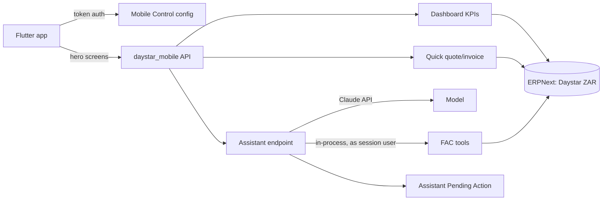

# Daystar Sales Mobile App — v1 Spec

Sep 25, 2026 · Mlu

## Summary

A Flutter app on the Daystar ERPNext site that lets Mlu, and later field reps, see sales health, ask an AI assistant about the business, and create and send quotes and invoices in under 90 seconds.

Day one is Mlu only, but every decision assumes reps with their own logins and no Desk access. That makes permissions, the assistant's write access, and price control the load-bearing parts of v1, ahead of the dashboard visuals.

## Problem statement

Frappe Desk on a phone is too heavy for the two things a founder and a field rep do most: checking how the business is doing and sending a quote or invoice. Creating and sending a document in mobile Desk means navigating full forms built for a desktop, so it gets postponed until Mlu is at a laptop.

Future sales reps will have no Desk access at all, so without this app they cannot quote or invoice on the road. The cost is slower quote turnaround, delayed invoicing, and cash that arrives later than it should.

## Goals and non-goals

**Goals**

1. Every Daystar quote and invoice is created and sent from the app, not Desk, within 30 days of launch.
2. Time from "New invoice" to "Sent" is under 90 seconds for an existing customer and priced items.
3. Mlu can read the business's sales health (profit, incoming, outgoing, pipeline) in one screen, in under 5 seconds from app open.
4. Any question FAC can answer is answerable from the app's chat, with every write confirmed by a tap first.
5. A rep can be onboarded later without changing the data model or permission design.

**Non-goals for v1**

| Out of v1 | Why | Trigger to bring it in |
| --- | --- | --- |
| Rule-based lead routing | Mlu assigns manually; volume is low | Manual assignment becomes a weekly bottleneck |
| Approval workflow on quotes/invoices | Price-list lock is the control for now | A rep sends something Mlu would have caught |
| WhatsApp Business Cloud API | Needs Meta verification, templates, per-conversation cost | Sends must be logged in ERPNext or come from a Daystar number |
| Payment capture in-app | Separate problem from sending | Customers ask to pay from the invoice link |
| Offline mode and push notifications | Adds sync complexity | Reps work in low-signal areas regularly |
| Legacy "The Daystar" (USD) company in reporting | Mixes currencies into headline profit | Legacy invoicing materially distorts the view |

## Users, roles and data visibility

Two roles, one site, one company ("Daystar", ZAR). Every user has their own Frappe login, so ERPNext permissions fence the app and the assistant alike.

| | Owner (Mlu) | Sales Rep (later) |
| --- | --- | --- |
| Login | Own Frappe user | Own Frappe user, custom role "Mobile Sales Rep", no Desk |
| Leads / Opportunities | All, plus an Unassigned queue | Only where `lead_owner` / `opportunity_owner` = self |
| Customers, Quotes, Invoices | All | Only where they appear in the Sales Team (Sales Person linked to their user) |
| Dashboard | Profit (invoiced), incoming sales, outgoing payments, receivables, full pipeline | Own pipeline, own invoices + outstanding, "my sales this month" weighted by contribution % |
| Accounting data (GL, Payment Entry, Purchase Invoice, Journal Entry) | Yes | No read access at all |
| Prices and discounts | Can override | Locked to Price List |
| Submit and share | Yes | Yes, no approval |
| Assistant | Full FAC capability, writes confirmed | Full FAC capability within their permissions, writes confirmed |

**Ownership rules**

- Transactions and customers: Sales Person in the Sales Team child table (existing Daystar practice, tracks contribution).
- Leads and opportunities: native `lead_owner` / `opportunity_owner`, defaulting to the creator.
- Leads created by n8n, web forms or imports land unassigned; Mlu assigns them manually.

**Enforcement notes**

- User Permissions do not reliably filter list views on a child-table field, so rep scoping on Quotation, Sales Invoice and Customer needs a `permission_query_conditions` + `has_permission` hook on the Sales Team.
- Documents with an empty Sales Team must not fall through to "visible to all"; the hook treats them as owner-only.

## Architecture

A Flutter client driven by the installed Mobile Control module, with three bespoke hero screens and all AI orchestration running inside Frappe.

**Mobile Control (already installed, currently disabled)**

- `Mobile Configuration` (single): enabled flag, package name, minimum app version, maintenance mode + message, and a table of exposed DocTypes.
- `Mobile Configuration Form` rows: DocType, `Mobile Workspace Group`, icon, order, and a meta-modified timestamp the app uses to refresh cached forms.
- `Mobile Refresh Token`: access/refresh token auth for this client.

**Screen split**

- Bespoke Flutter screens: Dashboard, Assistant chat, Quick quote/invoice + send.
- Mobile Control generic forms: Lead, Opportunity, Customer, Contact, and read views of any other exposed DocType.

**Assistant orchestration**

1. App posts a message to `daystar_mobile.api.assistant.chat`.
2. Endpoint calls the Claude API with FAC's tool definitions; the API key lives in site config, never on the device.
3. Read tools execute immediately as `frappe.session.user`.
4. Write tools (create, update, submit, cancel, delete, workflow actions) are not executed. They are stored as an `Assistant Pending Action` and returned as a confirmation card.
5. The tap calls `assistant.confirm(action_id)`, which re-checks permissions and executes. Every conversation and action is logged to a doctype.

**Sending**

- Email: server-side through ERPNext's outgoing email account, PDF attached, logged as a Communication on the document.
- WhatsApp: native share sheet (`share_plus`) with the PDF; user picks the contact. Not logged in ERPNext in v1.

**Price control**

`rate` and `discount_percentage` on item rows sit at a higher permlevel for the rep role, backed by a `validate` hook that rejects rates differing from the Price List, so the lock holds even via direct API calls.

## User stories

**Owner (Mlu)**

- As the owner, I want to see invoiced profit, incoming sales, outgoing payments and receivables for Daystar on one screen so that I know the business's health without opening Desk.
- As the owner, I want to create an invoice for an existing customer, submit it and email it in under 90 seconds so that invoicing never waits until I'm at a laptop.
- As the owner, I want to ask the assistant "who owes us more than 60 days" or "draft a quote for X" so that I get answers and drafts without navigating reports.
- As the owner, I want every assistant write shown as a card I must tap so that a misread instruction never submits, cancels or deletes a record.
- As the owner, I want a queue of unassigned leads so that I can assign n8n and web-form leads to reps.

**Sales rep (later)**

- As a rep, I want to see only my leads, opportunities, quotes and invoices so that the app shows my work, not the company's book.
- As a rep, I want to quote a customer from the Price List and share the PDF on WhatsApp from the customer's premises so that I close while I'm in front of them.
- As a rep, I want to see what my customers still owe on my invoices so that I can follow up on the visit.

**Edge cases**

- As a rep, when I try to change a rate, I want the field locked with a clear reason so that I know to ask the owner.
- As any user, when a submit fails because signal dropped, I want a clear retry with my entries kept so that nothing is sent twice or lost.
- As any user, when the assistant asks for something my role can't do, I want a plain "you don't have access" answer rather than an error dump.

## Requirements

**P0: must ship**

1. **Auth and config**: token login via Mobile Refresh Token; app honours Mobile Configuration's enabled flag, minimum version and maintenance mode.
   - Given maintenance mode is on, when the app opens, then it shows the maintenance message and nothing else.
   - Given the installed version is below minimum, then the app blocks use and prompts an update.
2. **Owner dashboard**: Profit (invoiced) for the period from the Daystar P&L; incoming sales (submitted Sales Invoices); outgoing payments (Payment Entries, type Pay); receivables; lead, opportunity and open-quote counts and values.
   - Figures match the ERPNext P&L and Accounts Receivable reports for the same period to the cent.
   - Only company "Daystar" is included; period switch covers this month, last month, this quarter, this financial year.
3. **Rep dashboard**: served by a whitelisted endpoint returning totals only; the device never receives GL rows.
   - A rep's responses contain no profit, supplier or payment-out figures.
4. **Quick quote / invoice**: bespoke screen: pick customer → add items (search, qty) → review totals and tax → submit → send.
   - Rates come from the customer's Price List; reps cannot edit rate or discount, and a tampered API request is rejected server-side.
   - A failed submit keeps the entries and offers retry; a retry never creates a duplicate (idempotency key per draft).
5. **Send**: email via the outgoing email account with the PDF and a Communication logged on the document; WhatsApp via the native share sheet with the PDF.
   - The email appears in the document's timeline in Desk.
6. **Assistant with confirm gate**: chat endpoint as described in Architecture.
   - No write tool runs without a confirmation tap; confirmation re-checks permission at execution time.
   - A pending action expires after 15 minutes and cannot be confirmed afterwards.
   - Every message, tool call and outcome is logged with user and timestamp.
7. **Rep scoping**: role "Mobile Sales Rep", permission hooks on Sales Team, owner fields on Lead and Opportunity.
   - A rep querying another rep's quote by name, via list, form or assistant, gets "not permitted".
8. **Unassigned leads queue** for the owner only.

**P1: fast follows**

- Quote → Sales Order → Invoice conversion in one tap.
- Payment reminder email for overdue invoices from the receivables list.
- Voice input in the assistant.
- Dashboard drill-down from a KPI to the underlying list.

**P2: design for, don't build**

- Lead routing rules (territory, round-robin).
- Approval workflow on quotes above a threshold.
- WhatsApp Business Cloud API with logging.
- Offline drafts and push notifications.
- Payment links on invoices.

## Success metrics

| Metric | Type | Target | Source |
| --- | --- | --- | --- |
| Share of quotes and invoices sent from the app | Leading | 100% of Mlu's by day 30 | Communication records tagged with the app's source |
| Median time New → Sent | Leading | < 90 s | App event timestamps |
| Dashboard figures vs ERPNext reports | Leading | 0 mismatches | Weekly spot-check against P&L and AR |
| Assistant writes confirmed vs rejected | Leading | Tracked, no target | Assistant Pending Action log |
| Days from delivery to invoice sent | Lagging | Down vs the prior 90 days | Sales Invoice posting date vs Delivery / SO date |
| Debtor days | Lagging | Down vs the prior 90 days | Accounts Receivable report |

Kill signal: if by day 30 Mlu is still falling back to Desk to send documents, the quick-send flow gets redesigned before any rep rollout.

## Decisions

**Open**

- [ ] Confirm the screen split (bespoke hero screens; Mobile Control for the rest). Adopted as default.
- [ ] Which Claude model and monthly spend cap for the assistant. Blocks the assistant endpoint.
- [ ] Which outgoing email account sends documents; shared Daystar address or per-rep. Blocks email send.
- [ ] How Mobile Control renders child tables (Sales Team, items) on generic forms. Verify before relying on it.

**Deferred**

| Decision | Trigger |
| --- | --- |
| Lead routing rules | Manual assignment becomes a weekly bottleneck |
| Approvals on quotes/invoices | A rep sends something that should have been caught |
| WhatsApp Cloud API | Sends must be logged or come from a Daystar number |
| Offline and push | Reps regularly work without signal |
| Legacy USD company in reporting | Legacy invoicing distorts decisions |

**Resolved trade-offs**

- Single site, internal tool over a sellable multi-tenant product.
- Own logins per rep over a shared account, so FAC inherits real permissions.
- Reps see only their own records; ownership via Sales Person on transactions, owner fields on leads and opportunities.
- Accrual profit (invoiced) over cash profit as the headline number.
- Daystar (ZAR) only over consolidating the legacy USD company.
- Role-split dashboards, no accounting access for reps.
- Full assistant capability with a confirm gate over read-only.
- Orchestration in Frappe over n8n or the phone.
- No approvals, prices locked to the Price List as the v1 control.
- Flutter + Mobile Control over a PWA.

## Phasing

| Phase | Scope | Exit gate |
| --- | --- | --- |
| 1. Foundation | `daystar_mobile` app, Mobile Control enabled and configured, token auth, price-lock hook | Mlu logs in on the phone; a tampered rate is rejected |
| 2. Quick-send | Quote/invoice screen, submit, email + WhatsApp share | Mlu sends every document from the app for 2 weeks |
| 3. Dashboard | Owner KPIs, then rep endpoint | Figures match P&L and AR |
| 4. Assistant | Chat endpoint, pending actions, confirm cards, logging | 20 real queries answered; no unconfirmed write |
| 5. Rep readiness | Mobile Sales Rep role, scoping hooks, unassigned queue | A test rep sees only their own records everywhere, including the assistant |

Design references (Mobbin) still to be added: finance KPI dashboard, AI chat with inline confirmation cards, create-invoice flow ending in a share sheet.
